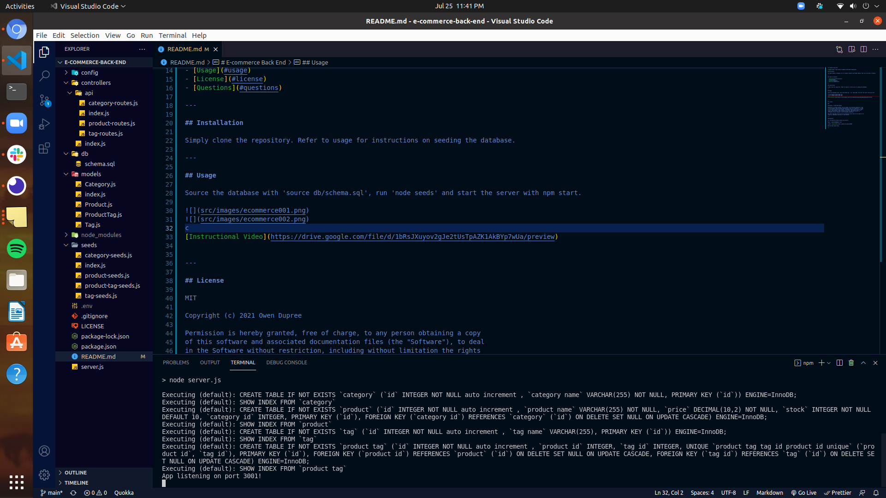
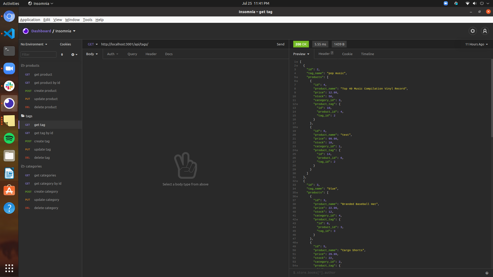

# E-commerce Back End

## Description

This app creates a database for an e-commerce website with CRUD requests that can be called in insomnia.

---

## Table of Contents

- [Installation](#installation)
- [Usage](#usage)
- [License](#license)
- [Questions](#questions)

---

## Installation

Simply clone the repository. Refer to usage for instructions on seeding the database.

---

## Usage

Source the database with 'source db/schema.sql', run 'node seeds' and start the server with npm start.

[Instructional Video](https://drive.google.com/file/d/1bRsJXuyov2gJe2tUsTpAZK1AkBYp7wUa/preview)

---

## License

MIT

Copyright (c) 2021 Owen Dupree

Permission is hereby granted, free of charge, to any person obtaining a copy
of this software and associated documentation files (the "Software"), to deal
in the Software without restriction, including without limitation the rights
to use, copy, modify, merge, publish, distribute, sublicense, and/or sell
copies of the Software, and to permit persons to whom the Software is
furnished to do so, subject to the following conditions:

The above copyright notice and this permission notice shall be included in all
copies or substantial portions of the Software.

---

## Questions

For any questions please contact me directly.

Email: <odupree1988@gmail.com>

GitHub: [odupree1988](https://github.com/odupree1988)

Made By Owen Dupree 2021

---
